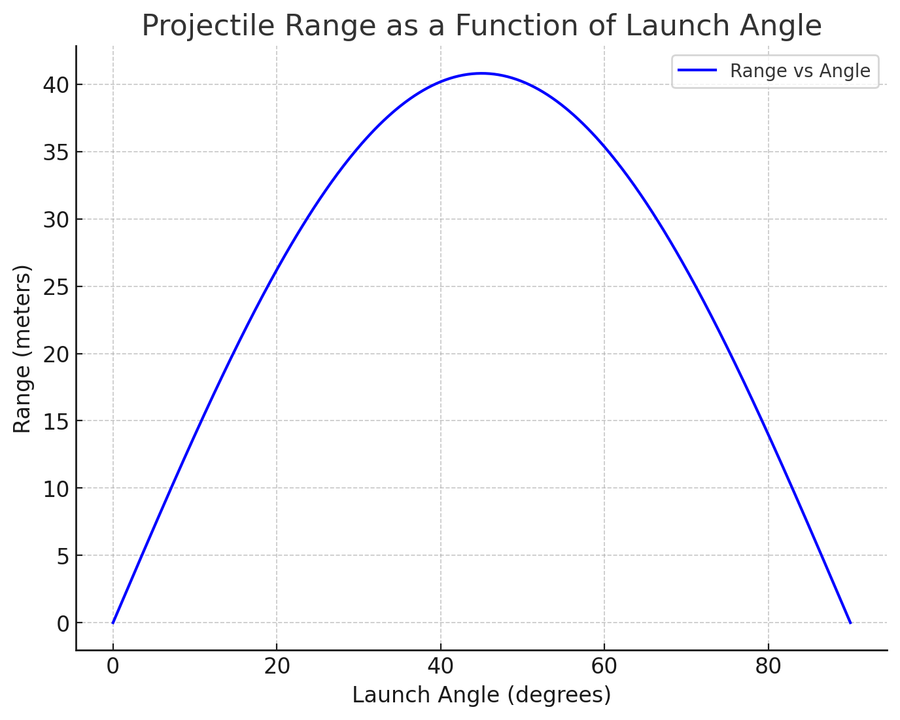

# Investigating the Range as a Function of the Angle of Projection

## Motivation

Projectile motion offers a fascinating opportunity to explore physics principles, where equations governing the motion of projectiles describe not just the motion of objects like soccer balls or rockets but can also be extended to study more complex systems in engineering and astrophysics. The basic setup involves the analysis of how the range (the horizontal distance traveled) of a projectile depends on the angle of projection.

## 1. Theoretical Foundation:

### Derivation of the Governing Equations

Projectile motion is typically modeled in two dimensions (horizontal and vertical) under the influence of gravity. We start by analyzing the motion in both directions independently.

#### Horizontal motion (x-direction):

The horizontal velocity is constant, as there are no forces acting horizontally (assuming no air resistance).

\[
\frac{d^2 x}{dt^2} = 0 \quad \Rightarrow \quad \frac{dx}{dt} = v_0 \cos(\theta)
\]

Where:
- $v_0$ is the initial velocity.
- $\theta$ is the launch angle.

The solution to this differential equation is:

\[
x(t) = v_0 \cos(\theta) \cdot t
\]

#### Vertical motion (y-direction):

The vertical motion is influenced by gravity, which causes a downward acceleration.

\[
\frac{d^2 y}{dt^2} = -g
\]

Where $g$ is the acceleration due to gravity (approximately $9.8 \, \text{m/s}^2$ on Earth).

The solution to this differential equation is:

\[
y(t) = v_0 \sin(\theta) \cdot t - \frac{1}{2} g t^2
\]

This equation describes the height of the projectile as a function of time.

### Time of Flight and Range

To find the time of flight, we set $y(t) = 0$ because the projectile will return to the ground when it reaches the same vertical position (height = 0). Solving for $t$, we get:

\[
0 = v_0 \sin(\theta) \cdot t - \frac{1}{2} g t^2
\]

This simplifies to:

\[
t = \frac{2 v_0 \sin(\theta)}{g}
\]

The range $R$ of the projectile is the horizontal distance it travels when it reaches the ground, which occurs at time $t$. From the horizontal motion equation, we have:

\[
R = x(t) = v_0 \cos(\theta) \cdot t = v_0 \cos(\theta) \cdot \frac{2 v_0 \sin(\theta)}{g}
\]

Simplifying the expression:

\[
R = \frac{v_0^2 \sin(2\theta)}{g}
\]

This is the equation for the range of a projectile.

## 2. Analysis of the Range:

### Range as a Function of the Launch Angle

From the derived equation:

\[
R = \frac{v_0^2 \sin(2\theta)}{g}
\]

We observe that the range $R$ depends on:
- The initial velocity $v_0$,
- The launch angle $\theta$,
- The gravitational acceleration $g$.

Since $\sin(2\theta)$ reaches its maximum value of 1 when $2\theta = 90^\circ$, this means the optimal launch angle for maximum range is:

\[
\theta = 45^\circ
\]

Thus, the range is maximized at a $45^\circ$ launch angle. As $\theta$ deviates from $45^\circ$, the range decreases due to the behavior of the sine function.

### Influence of Initial Velocity and Gravitational Acceleration

- **Initial Velocity $v_0$**: The range increases with the square of the initial velocity. This means that increasing the initial speed at which the projectile is launched increases the range, but the relationship is quadratic.
  
- **Gravitational Acceleration $g$**: The range decreases as gravity increases. If gravity is stronger (like on a larger planet), the range will be smaller for the same initial velocity and launch angle.

## 3. Practical Applications:

This model can be applied to many real-world scenarios, such as:
- **Sports**: In games like soccer, basketball, and golf, the angle at which a ball is kicked, thrown, or hit can dramatically affect the distance traveled.
- **Engineering**: This model can be used to calculate the range of artillery shells, missiles, or drones, considering varying initial velocities and launch angles.
- **Astrophysics**: The principles of projectile motion under gravity are useful in studying the trajectories of satellites, space probes, and other celestial objects.

## 4. Implementation:

To simulate the projectile motion and visualize the range as a function of the launch angle, you can write a Python script using libraries such as NumPy and Matplotlib.

Here’s an implementation of the simulation:

```python
import numpy as np
import matplotlib.pyplot as plt

# Constants
g = 9.8  # acceleration due to gravity (m/s^2)
v0 = 20  # initial velocity (m/s)

# Define a function to calculate the range for a given angle
def range_of_projectile(v0, theta_deg, g):
    theta = np.radians(theta_deg)  # convert angle to radians
    return (v0**2 * np.sin(2*theta)) / g

# Angle range from 0 to 90 degrees
angles = np.linspace(0, 90, 500)

# Calculate the range for each angle
ranges = range_of_projectile(v0, angles, g)

# Plot the results
plt.figure(figsize=(8, 6))
plt.plot(angles, ranges, label="Range vs Angle")
plt.title("Projectile Range as a Function of Launch Angle")
plt.xlabel("Launch Angle (degrees)")
plt.ylabel("Range (meters)")
plt.grid(True)
plt.legend()
plt.show()
Output Interpretation
This graph will display the projectile range as a function of the launch angle, showing that the range is maximized at a $45^\circ$ angle and decreases as the angle deviates from this optimal value.
```

## 5. Limitations and Suggestions for Improvements:
The current model assumes:

No air resistance, which isn't realistic for most real-world projectiles.

Flat ground, neglecting any effects of terrain variation.

Constant gravitational acceleration, which isn't accurate for higher altitudes or other celestial bodies.

To improve the model, you could:

Incorporate air resistance using drag equations to model the deceleration of the projectile.

Account for varying terrain by modifying the initial and final conditions of the projectile’s path.

Consider varying gravity for different planetary conditions (e.g., Mars, Moon).

Conclusion
Through this task, we explored the fundamental principles of projectile motion and derived the governing equations. By analyzing how the range depends on the launch angle, initial velocity, and gravity, we gained insight into both the physics and practical applications of projectile motion. The implementation of a simulation further enhances the understanding by visualizing the relationships and behaviors. Finally, by reflecting on the limitations of the idealized model, we identified possible improvements for more accurate real-world modeling.

